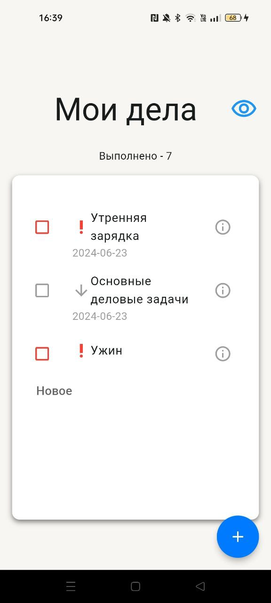

# Todo List
Это приложение, которое позволяет пользователям просматривать список новостей и просматривать подробную информацию о каждой выбранной новости. Также можно добавлять интересующие новости в избранное.
Новости можно искать по поиску и фильтровать их по дате публикации и сортировать. Приложение состоит из двух экранов:

### Главный экран:
На этом экране отображается список дел. Пользователи могут помечать дела выполненными, удалять их, редактировать. 


### Экран добавления/редактирования дел:
Пользователь может описать свои дела, поставить важность, установить дедлайн и удалить текущее занятие.

## Что добавлено
 - Реализовано хранение дел в бд на телефоне
 - Все дела также сохранеются на сервере и выполняется синхронизация
 - Для state management используется Riverpod
 - Добавлена интернационализация
 - Добавлены flutter_lints
 - Тесты для класа работы с сетью, бд и класса репозитория и интеграционный тест
 - Обработка ошибок
 - Слой навигации переписан на Navigator 2.0
 - Есть диплинки


## Скриншоты
<table>
  <tr>
    <td></td>
    <td></td>
    <td></td>
  </tr>
  <tr>
    <td></td>
    <td></td>
    <td></td>
  </tr>
</table>

## APK
Apk файл лежит в папке apk


## Deployment

Начало работы
Чтобы запустить локальную копию, выполните следующие простые шаги:


Клонируйте репозиторий:
```bash
  git clone https://gitlab.com/anastasiaduplina/news_app.git
```

Перейдите в каталог проекта:
```bash
  cd your-repo-name
``` 
Установите зависимости:
```bash
   flutter pub get
```
Запустите кодогенерацию
```bash
   dart run build_runner build
```
Запустите приложение:
```bash
  flutter run --dart-define=TOKEN=your_token

```


