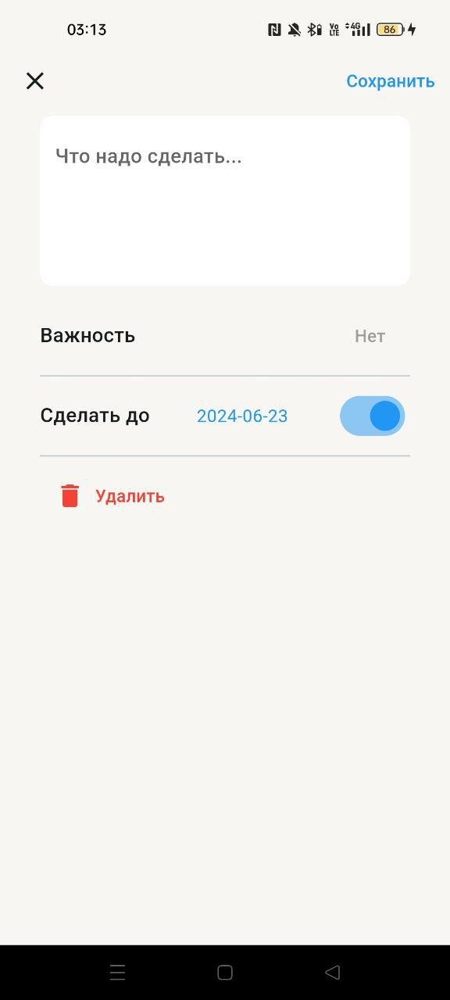
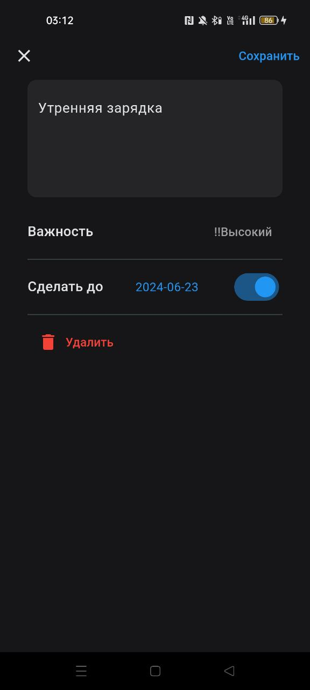

# Todo List
Это приложение, которое позволяет пользователям создавать список дел, устанавливать им дедлайны, важность.

### Главный экран:
На этом экране отображается список дел. Пользователи могут помечать дела выполненными, удалять их, редактировать. 


### Экран добавления/редактирования дел:
Пользователь может описать свои дела, поставить важность, установить дедлайн и удалить текущее занятие.

## Что добавлено
 - 2 флейвора(dev версия отличается названием приложения)
 - распространение через Firebase App Distribution 
 - Firebase Crashlitics
 - Firebase analytics для аналитики по событиям: добавление, удаление, выполнение, переходы по экранам
 - настроен CI:форматирование, линтер, тесты, сборка
 - анимация выполнения задач
 - переключение на ночную тему


## Скриншоты
<table>
  <tr>
    <td></td>
    <td></td>
  </tr>
  <tr>
    <td></td>
    <td></td>
  </tr>
</table>

## APK
Apk файл лежит в папке apk


## Deployment

Начало работы
Чтобы запустить локальную копию, выполните следующие простые шаги:


Клонируйте репозиторий:
```bash
  git clone https://gitlab.com/anastasiaduplina/news_app.git
```

Перейдите в каталог проекта:
```bash
  cd your-repo-name
``` 
Установите зависимости:
```bash
   flutter pub get
```
Запустите кодогенерацию
```bash
   dart run build_runner build
```
Запустите приложение:
```bash
  flutter run --flavor prod --dart-define=TOKEN=your_token

```
Или можно запустить dev версию:
```bash
  flutter run --flavor dev --dart-define=TOKEN=your_token

```


